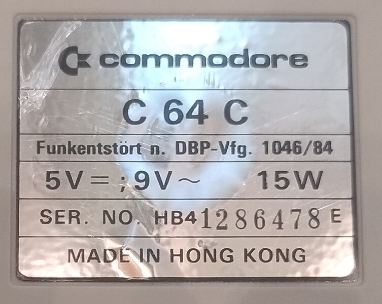

Equipment
=========

I didn't really get into retro computing until mid-2026. I'd always been interested in the topic.
I watched YouTube videos and looked into the 6502 CPU a bit.
But it took my coworker to really get me hooked on the subject.

So I checked out `WillHaben <https://www.willhaben.at>`_ and searched for "Commodore C64" and "VIC-20".
Those were the first items I planned to add to my collection.
I came across two offers pretty quickly - right in my area.

First, I bought the VIC-20. It was still in its original packaging.
The seller had received it as a confirmation gift. However, he didn’t really enjoy using it,
so the computer ended up in the basement. Luckily for me, he didn’t just throw it away, so
I was able to get the little computer through Willhaben.

The Commodore C64 had also been stored in a basement.
However, the man who sold it to me told me that he and his brother had used it quite a lot to
play games. He also mentioned that this device was sometimes used to measure time during various races.
In recent years, though, it had also been stored in a basement.
Not exactly the best storage conditions. As a result, the machine showed a fair amount of wear and tear,
and inside, dust, dirt, and other debris had piled up. It's also possible that the case briefly served as a
home for a spider. At least, I found traces of one. The item for sale, however, was a larger collection.
And so, in addition to the C64-C, there were also two floppy disk drives. These were in a similar condition.

.. contents::

VIC-20
------

.. todo::
   Add VIC-20 description and photos.

C64-C 01 (lets call him ALPHA)
------------------------------

.. todo::
   Finish section.

.. image:: images/C64-C_01_dirty_01.jpg

C64-C 02 (lets call him BRAVO)
------------------------------

.. todo::
   Finish section.

Diskdrives
----------

.. todo::
   Finish section.

Links
-----

`link01 <https://hd.retrorewind.ca/commodore/c64/assy-250469>`_

`link02 <https://www.c64-wiki.de/wiki/Hauptplatine#ASSY_250469>`_

`link03 <https://www.zimmers.net/anonftp/pub/cbm/schematics/computers/c64/>`_

`link04 <https://www.c64-wiki.com/wiki/Motherboard>`_

`link05 <https://www.c64-wiki.com/wiki/Motherboard#ASSY_250469>`_

`Schematic PDF <https://www.zimmers.net/anonftp/pub/cbm/schematics/computers/c64/250469-rev.A.pdf>`_
