Equipment
=========

.. contents::

Commodore
=========

I didn't really get into retro computing until mid-2026. I'd always been interested in the topic.
I watched YouTube videos and looked into the 6502 CPU a bit.
But it took my coworker to really get me hooked on the subject.

So I checked out `WillHaben <https://www.willhaben.at>`_ and searched for "Commodore C64" and "VIC-20".
Those were the first items I planned to add to my collection.
I came across two offers pretty quickly - right in my area.

First, I bought the VIC-20. It was still in its original packaging.
The seller had received it as a confirmation gift. However, he didn’t really enjoy using it,
so the computer ended up in the basement. Luckily for me, he didn’t just throw it away, so
I was able to get the little computer through Willhaben.

The Commodore C64 had also been stored in a basement.
However, the man who sold it to me told me that he and his brother had used it quite a lot to
play games. He also mentioned that this device was sometimes used to measure time during various races.
In recent years, though, it had also been stored in a basement.
Not exactly the best storage conditions. As a result, the machine showed a fair amount of wear and tear,
and inside, dust, dirt, and other debris had piled up. It's also possible that the case briefly served as a
home for a spider. At least, I found traces of one. The item for sale, however, was a larger collection.
And so, in addition to the C64-C, there were also two floppy disk drives. These were in a similar condition.

VIC-20
------

.. todo::
   Add VIC-20 description and photos.

C64-C 01 (lets call him ALPHA)
------------------------------

.. todo::
   Finish section.

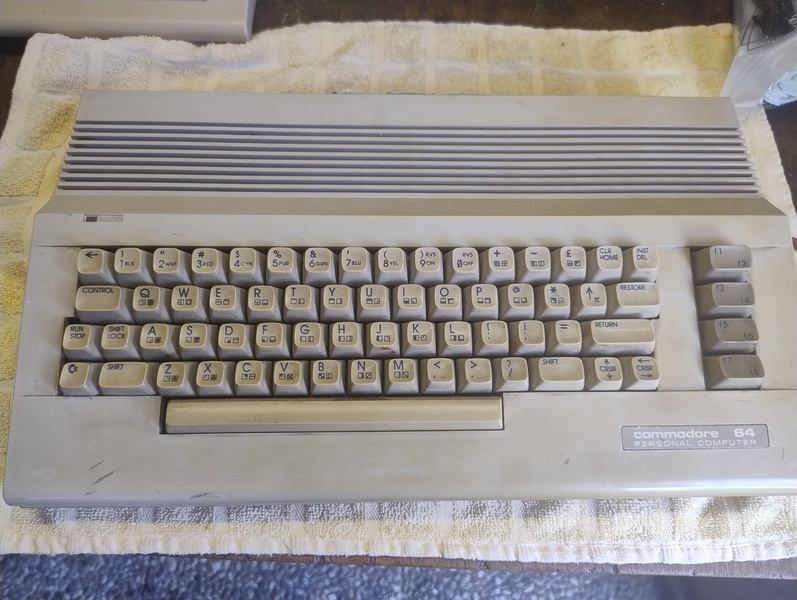

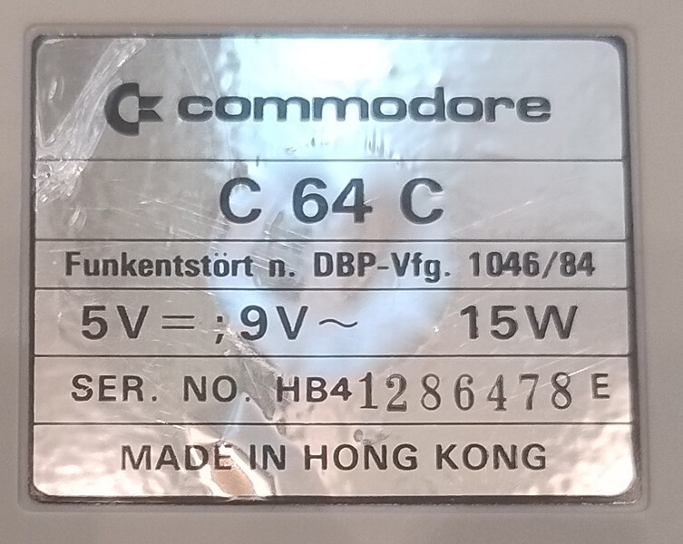

C64-C 02 (lets call him BRAVO)
------------------------------

.. todo::
   Finish section.

Diskdrives
----------

.. todo::
   Finish section.

Links
-----

`link01 <https://hd.retrorewind.ca/commodore/c64/assy-250469>`_

`link02 <https://www.c64-wiki.de/wiki/Hauptplatine#ASSY_250469>`_

`link03 <https://www.zimmers.net/anonftp/pub/cbm/schematics/computers/c64/>`_

`link04 <https://www.c64-wiki.com/wiki/Motherboard>`_

`link05 <https://www.c64-wiki.com/wiki/Motherboard#ASSY_250469>`_

`Schematic PDF <https://www.zimmers.net/anonftp/pub/cbm/schematics/computers/c64/250469-rev.A.pdf>`_

Nintendo
========

SNES
----

The Super Nintendo Entertainment System, or SNES for short, was pretty much THE gaming console of my childhood.                                                                      
So it was only logical that, if I found the right deal, I'd get one for myself.                                                                                           
And I got lucky. I found one in very good condition on “WillHaben.”

The SNES already had a 16-bit CPU, but at its core it was still a 6502.

As always, I took the device apart and gave it a thorough cleaning with water and dish soap.
I cleaned the circuit board with isopropyl alcohol.
It looks like new.

The screws Nintendo used to secure the case are called *Gamebit security screws*.
So you need a special screwdriver to open the SNES.

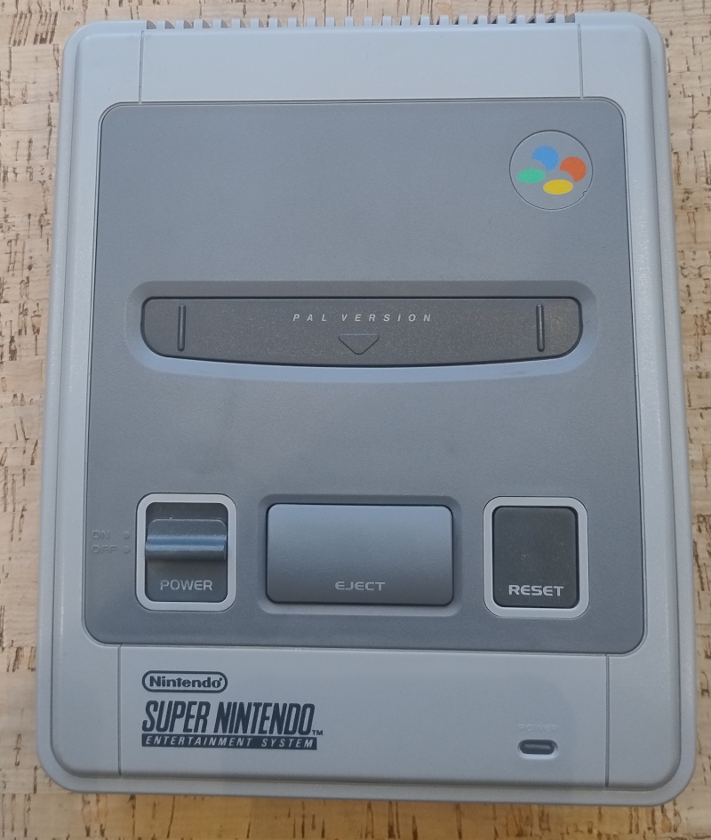

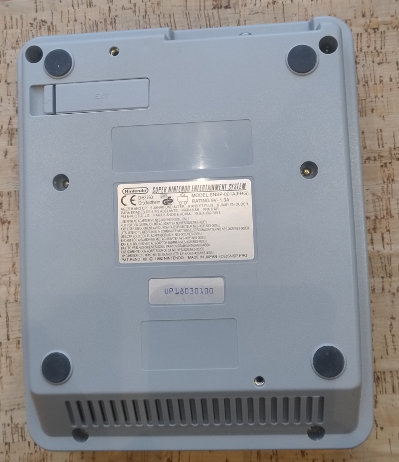

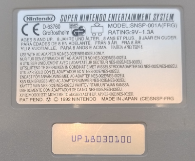

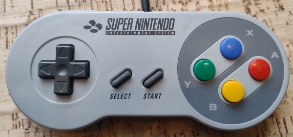

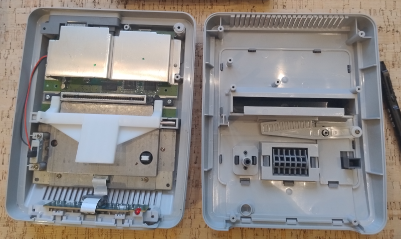

The power switch is connected to the motherboard via a cable.
You can simply unplug the connector.
The switch itself is secured to the case with two screws.

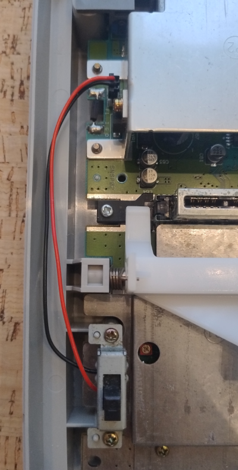

There is another circuit board that is connected to the motherboard via a ribbon cable.
This circuit board is plugged into the front panel and is used to connect the controllers to the device.
Once you've removed the ribbon cable, you can simply pull this unit straight up to remove it.

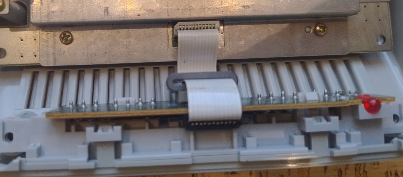

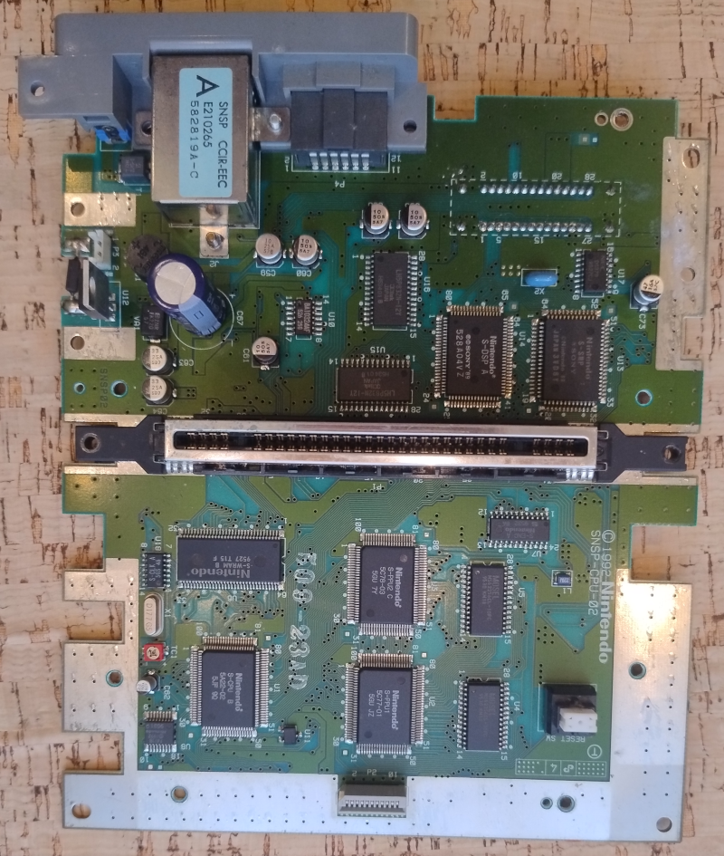

Actually, it's almost more work to take the controller apart than it is to take the SNES itself apart.

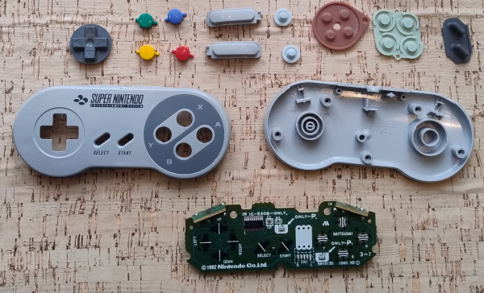

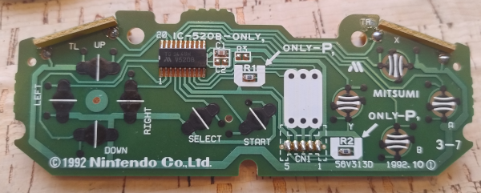

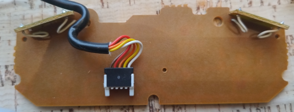

You have to reinsert these rubber pads with the contact surface for the circuit board exactly as they were before.
If you twist them even slightly, the controller won't work.

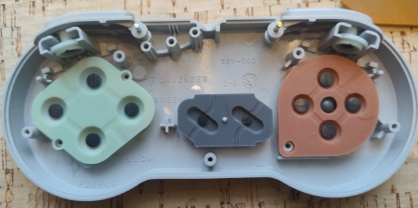

Links
-----

`SNES Wikipedia <https://en.wikipedia.org/wiki/Super_Nintendo_Entertainment_System>`_

`Ricoh 5A22 CPU <https://en.wikipedia.org/wiki/Ricoh_5A22>`_

`WDC 65C816 CPU <https://en.wikipedia.org/wiki/WDC_65C816>`_
