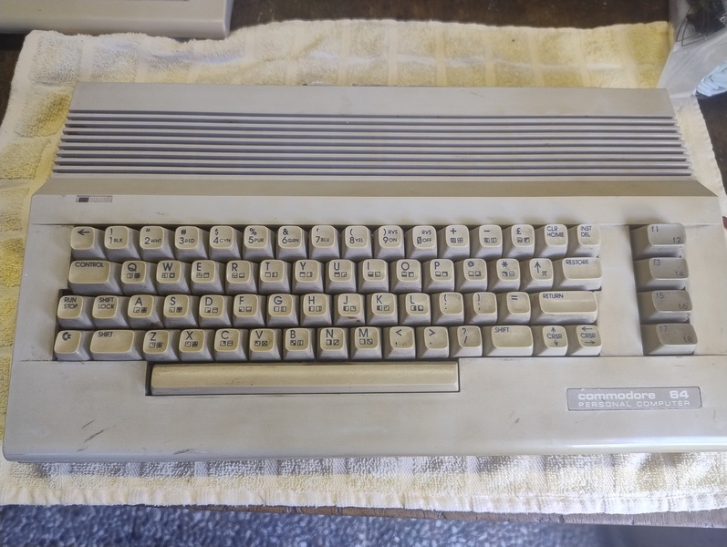
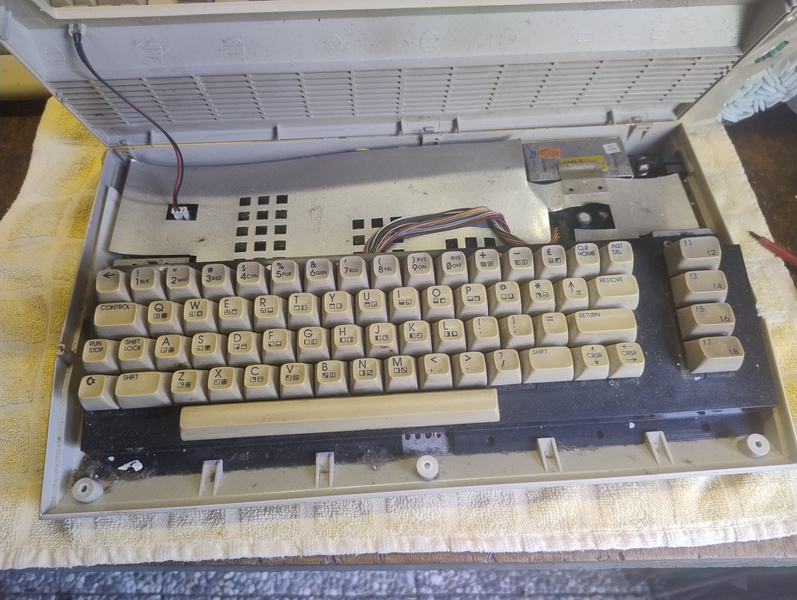
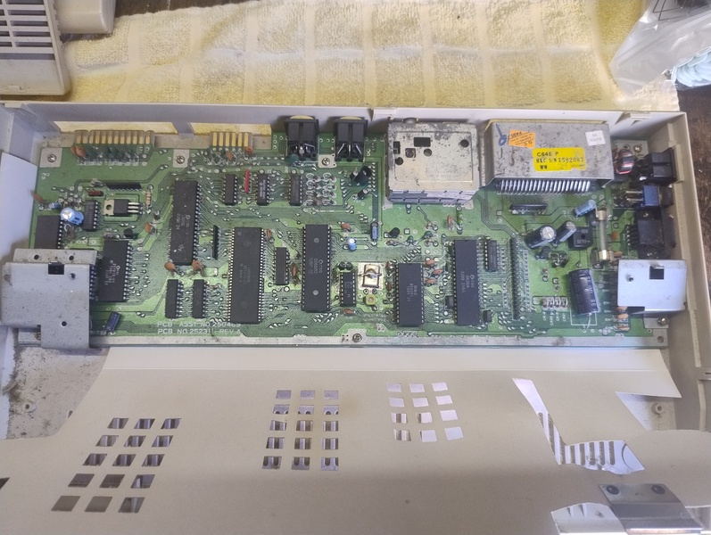
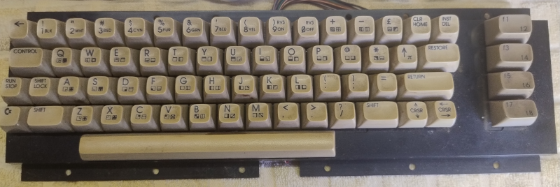
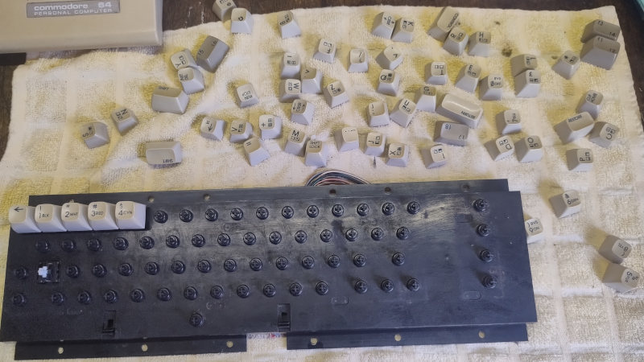
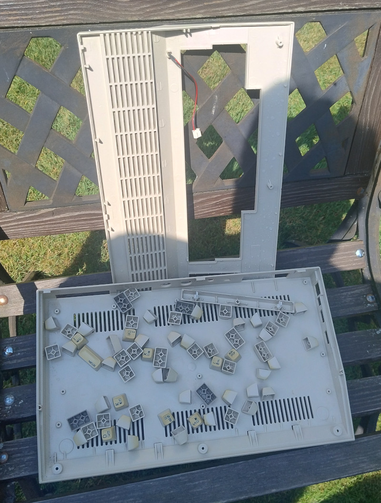
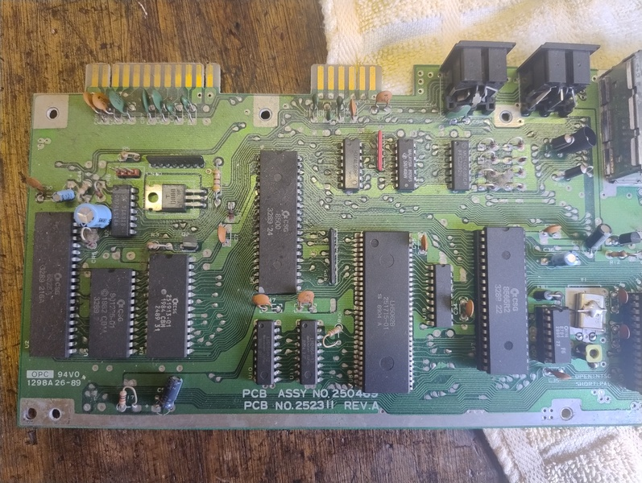
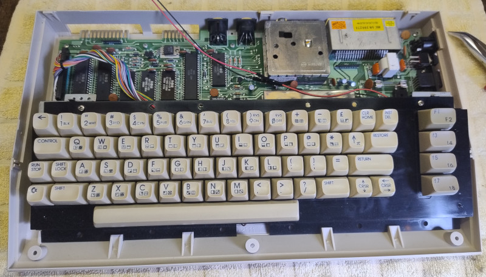

Restauration and cleaning
=========================

Right after I bought it, I started cleaning the equipment.
It was desperately needed, since some of the computers had been stored
in the basement without being boxed up. A lot of dust and other stuff collects there.

C64-C ALPHA
-----------

The Commodore C64 C has three screws on the bottom. If you unscrew them, you can
tilt the case back very easily. You have to be a little careful here so as not to
break the plastic clips.
A cable runs from the motherboard to the upper case shell.
That is the power LED.

Next, you need to remove the keyboard. It is held in place at the bottom by plastic clips and
connected to the motherboard at the top with two screws on brackets. The keyboard cable can also be unplugged.

Next up is the motherboard. It is secured to the lower half of the case with several screws.
Once these screws have been removed, the motherboard can be easily taken out of the case.

Afterwards I took the keyboard apart. I highly recommend being very careful here.
It’s best to use a keycap puller. There are very affordable sets available on Amazon. See Equipment.
Also, when pulling off the keycaps, you have to be careful not to lose the spring underneath.
I pulled off my first keycap and the spring popped right out.
Looking for a gray spring on a gray concrete floor is no fun.
The spring for the spacebar needs to be handled separately, as it’s a bit stiffer.
It’s best to place the springs in a small container so you don’t lose them.

After that, I gave all the parts a thorough cleaning with warm water and dish soap.
I let the parts soak for a while and then cleaned everything thoroughly with a sponge.
The keycaps, too.
In this picture, you can see the parts drying in the sun.

While the case parts were drying, I turned my attention to the motherboard.
First, I blew the dust off it with some compressed air from a can, and then I cleaned
off the rest with a brush and isopropyl alcohol, paying special attention to the
interface contacts and the back side.

After that, I put everything back together.
It looks much better...

Disc Drives
-----------

.. todo::
   Finish section.

Used Equipment
--------------

`Keycap Puller Amazon <https://www.amazon.de/dp/B0D2P7CP4F?ref=ppx_yo2ov_dt_b_fed_asin_title>`_

`Compressed Air in a Can Amazon <https://www.amazon.de/dp/B00TA2R282?ref=ppx_yo2ov_dt_b_fed_asin_title&th=1>`_

`Isopropanol Alcohol Amazon <https://www.amazon.de/dp/B0C4FKV9HY?ref=ppx_yo2ov_dt_b_fed_asin_title&th=1>`_
