Retro Brighting
===============

Retrobrighting is a process for restoring yellowed plastic to its original beauty.

`Retrobright Wikipedia <https://en.wikipedia.org/wiki/Retrobright>`_

I wanted to show you here how I did it, what I used,
and my results.

.. contents::

Equipment
---------

Of course, you need hydrogen peroxide for this.
You can find various statements online about the concentration.
In fact, in Austria, you can’t buy a concentration
higher than 12 percent.
I decided to order two 5-liter containers with a 3% concentration.

`Hydrogen peroxide Amazon <https://www.amazon.de/dp/B086WC45ZY?ref=ppx_yo2ov_dt_b_fed_asin_title>`_

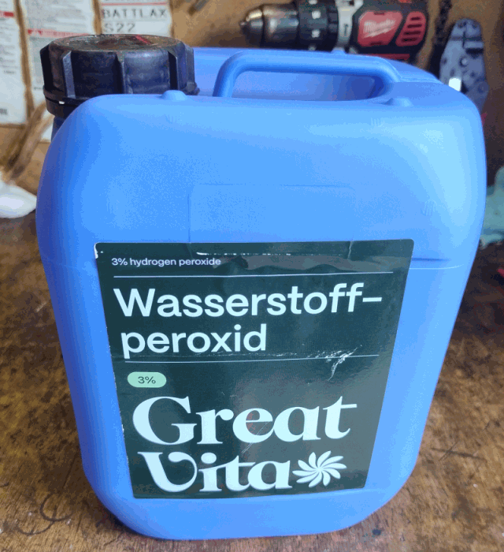

In addition, you'll need a container that allows light or UV rays to pass
through and is large enough to hold the housing parts.

I used a clear plastic bag for the keycaps.

And then you also need UV light. There are tutorials that use UV lamps and
LED strips wrapped around the containers. But I decided to go with the good
old sun. I did this in the middle of summer, so UV light isn't a problem.

Procedure
---------

First, all devices must be disassembled.
Only the yellowed housing parts should be placed in the hydrogen peroxide.
The housing parts also float in the hydrogen peroxide.
Therefore, they must be weighted down.
I used a large wrench for this.
The problem with this is that UV light doesn’t reach these areas.
So during the process, the weight needs to be moved around occasionally to
ensure an even result.

After that, I filled the plastic container with hydrogen peroxide until
everything was covered.
I put the keycaps in a clear plastic bag, filled it with
hydrogen peroxide, and tied the top shut.

Then I left everything in the sun for several hours.

A gas forms during this process. I have no idea what kind.
Small gas bubbles then cling to the keycap parts.
I shook these off at irregular intervals.

In the evening, I took everything out of the hydrogen peroxide bath and
rinsed it with water.

Here are the photos.

Images Diskdrives
-----------------

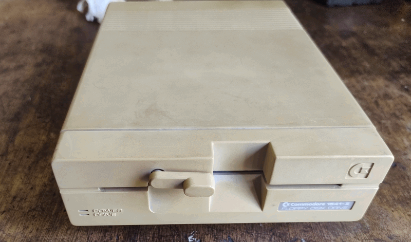

There was a sticker attached to the side of the floppy disk drive.
Here you can see the original color of the case.

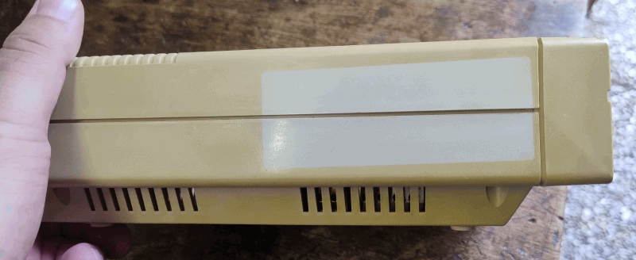

Here you can see the wrench I used as a weight.

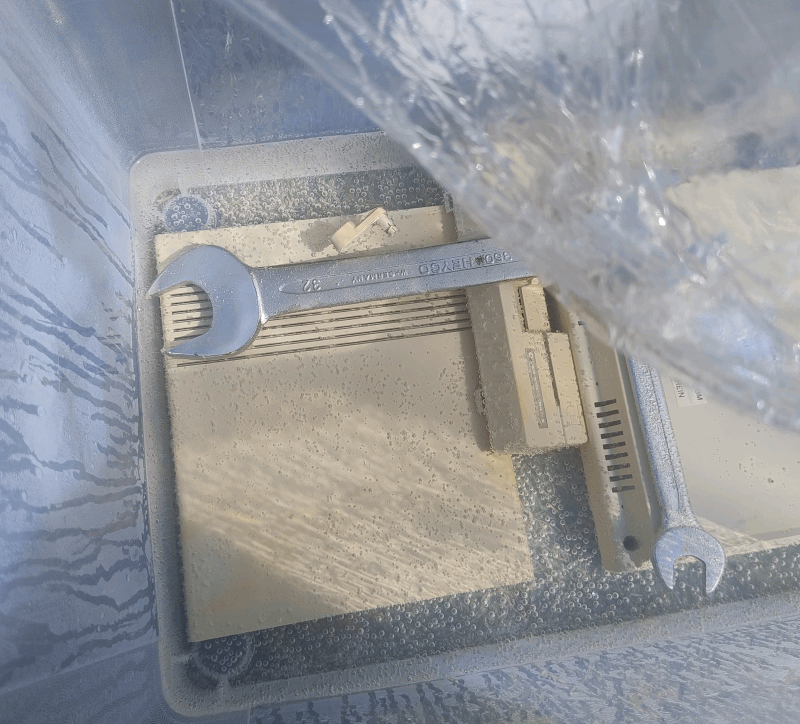

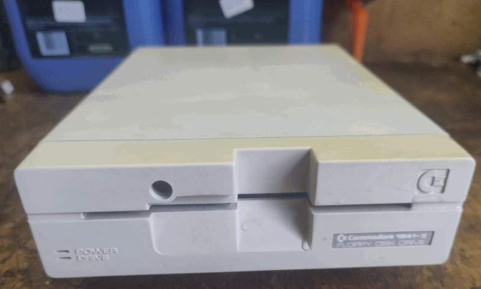

The spot where the sticker was is barely recognizable anymore.

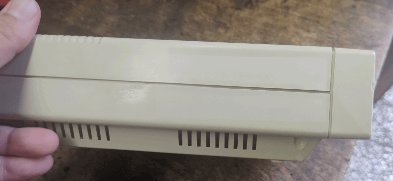

Images C64-C ALPHA
------------------

The keycaps are very yellowed.

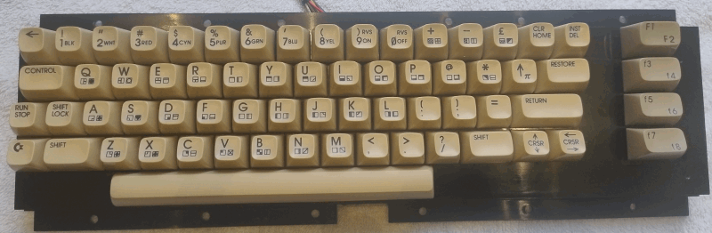

Here you can see how I attached the wrenches to the bottom of the housing using cord.
Don't forget to move the cord a little when you get the chancer. Otherwise,
a yellow line will remain visible.

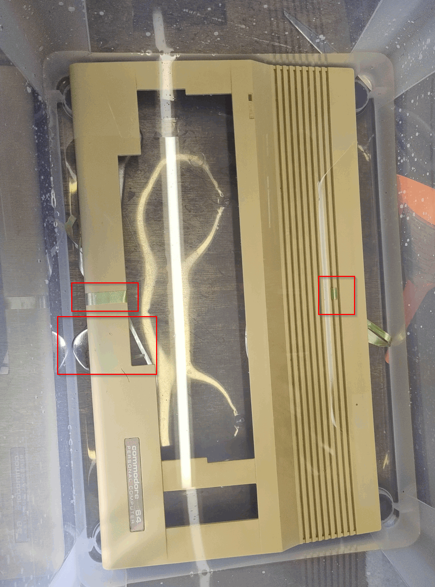

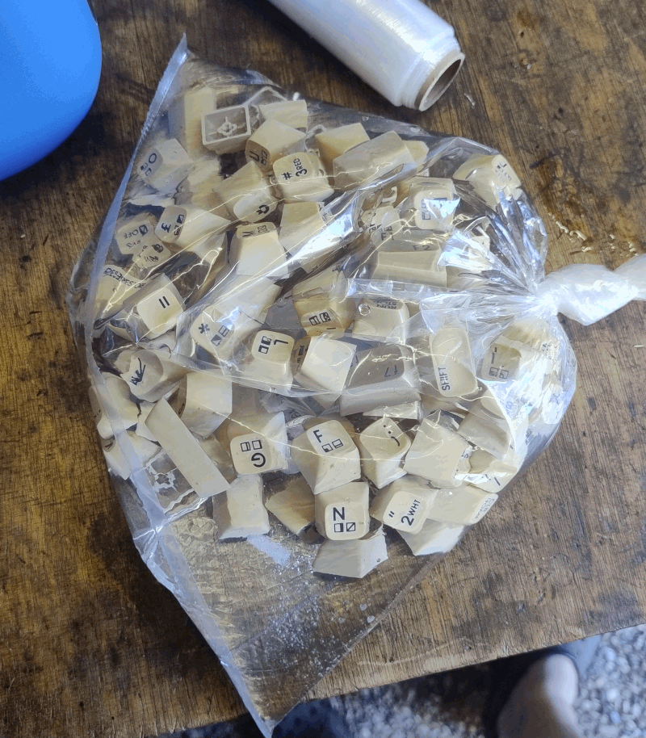

Here's the keyboard after the process. I think the result is pretty impressive.

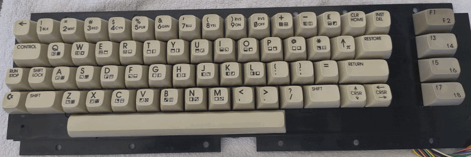

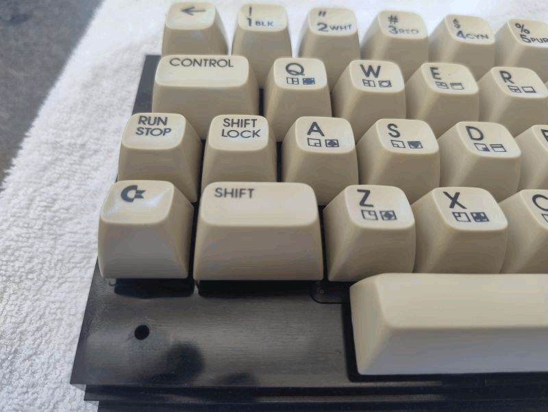

Result
------

I'm very happy with the result. You can really see it on the side of the floppy drive,
where the sticker was, and on the keycaps.

I read online that the result isn't permanent. Apparently, the plastic parts will
turn yellow again. I have no idea how long the result will last.
